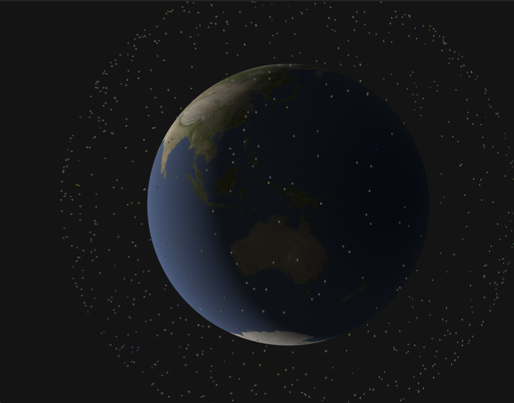

Learning wgpu



steps
1. Create instance to create Adapter and Surface.
2. Adapter handle graphic card. We create Device and Queue from it.
3. Get Pipeline setup.
4. Have Vertex and indices now.
5. Camera moves with controller.

##
Current Status:

Lot of spheres

##
Raytracing Implementation plan:

Plan: Ray Tracing in One Weekend on the GPU

The core architectural shift is: **replace the rasterizer with a GPU compute ray tracer + a display pass.** Here's how every piece maps to your current code:

---

### Architecture Overview
File layout

| File | Responsibility | Lines |
|------|---------------|-------|
| `common.wgsl` | `Uniforms`, `SphereGpu`, `Ray`, `Hit`, `ScatterResult`, all `@group` bindings | ~125 |
| `rng.wgsl` | `pcg`, `rand`, `rand_unit_sphere`, `rand_in_unit_sphere`, `rand_in_unit_disk` | ~72 |
| `geometry.wgsl` | `sphere_hit`, `hit_world` | ~82 |
| `sky.wgsl` | `sky_color` | ~14 |
| `materials/lambertian.wgsl` | `scatter_lambertian` | ~33 |
| `materials/metal.wgsl` | `scatter_metal` | ~32 |
| `materials/dielectric.wgsl` | `schlick`, `scatter_dielectric` | ~65 |
| `materials/dispatch.wgsl` | `MAT_*` constants + `scatter()` router | ~68 |
| `trace.wgsl` | `trace()` iterative path tracer | ~49 |
| `main.wgsl` | `cs_main` entry point | ~82 |

---

### How to add a new material (e.g. Emissive)

```exp_wgpu/src/shaders/materials/dispatch.wgsl#L29-32
const MAT_LAMBERTIAN: u32 = 0u;
const MAT_METAL:      u32 = 1u;
const MAT_DIELECTRIC: u32 = 2u;
// ↑ step 2: add  const MAT_EMISSIVE: u32 = 3u;
```

1. **Create** `src/shaders/materials/emissive.wgsl` — write `fn scatter_emissive(...) -> ScatterResult`
2. **Add one line** to `dispatch.wgsl` — `const MAT_EMISSIVE: u32 = 3u;` and a `case 3u: { return scatter_emissive(...); }`
3. **Add one line** to `raytracer.rs` — `include_str!("./shaders/materials/emissive.wgsl"),` before the dispatch line

`trace.wgsl` and `main.wgsl` are **never touched**.
